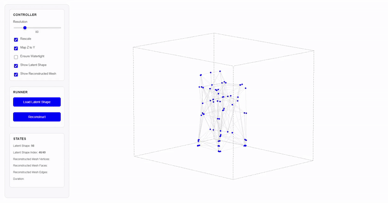
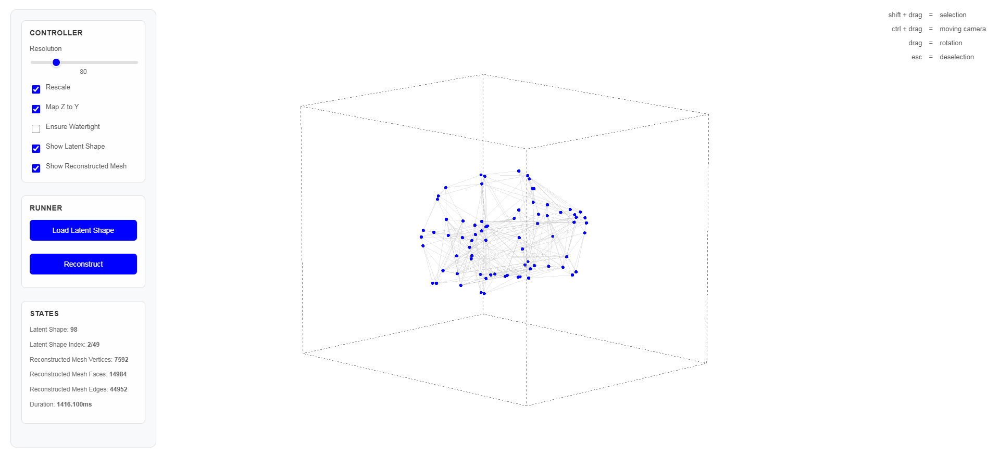
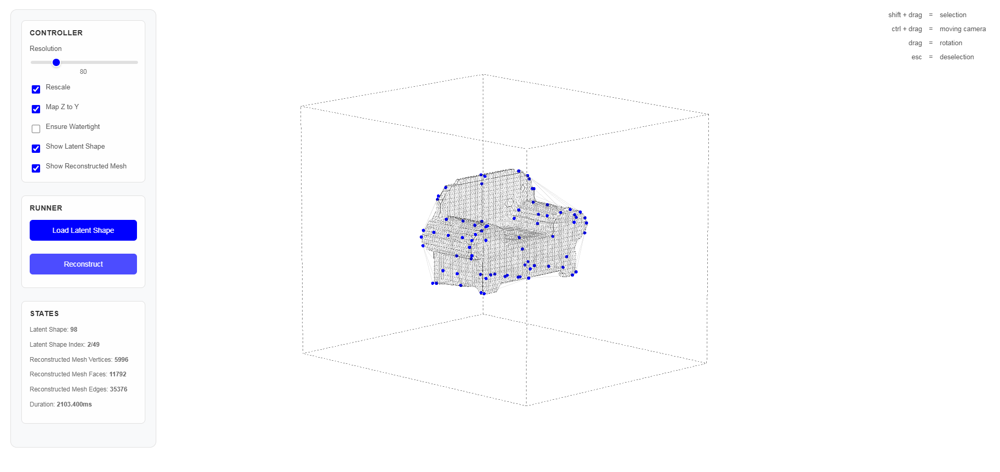

# Latent Shapes

<div align="justify">
  In the best of my knowledge, latent vectors are initialized from a normal distribution and then updated during training to minimize the loss.
  Although linear interpolation can be used in the manipulations between latent vectors, and similar vectors can be placed in spatially close locations, the latent vectors themselves do not have a specific shape.
  <br><br>
  This project takes inspiration from this <a href="https://parkcheolhee-lab.github.io/latent-points/">perspective</a> and explores two main conceptions:
  <strong>1) Latent vectors with geometric shape ─</strong> exploring what happens if we give the latent vectors a geometric structure, and how that might help us better understand or control the results;
  <strong>2) Interactive manipulation using the latent vector ─</strong> making it possible for people to easily change and play with the latent vectors, so they can see and understand the effects right away and create new shapes or designs interactively.
  <br><br>
  <mark>The detailed process of this project is archived <a href="https://parkcheolhee-lab.github.io/latent-shapes/">here</a>.</mark>
</div>

<br>

<div align="center" text-align="justify">
  　　
  <p align="center">
    <i>
    Latent Vector Manipulation <br> with Mouse Dargging
    </i>
  </p>
</div>

<br><br>

# Installation

This repository uses the [image](/.devcontainer/Dockerfile) named `nvcr.io/nvidia/pytorch:23.10-py3` for running devcontainer.


1. Ensure you have Docker and Visual Studio Code with the Remote - Containers extension installed.
2. Clone the repository.

    ```
        git clone https://github.com/PARKCHEOLHEE-lab/latent-shapes.git
    ```

3. Open the project with VSCode.
4. When prompted at the bottom left on the VSCode, click `Reopen in Container` or use the command palette (F1) and select `Remote-Containers: Reopen in Container`.
5. VS Code will build the Docker container and set up the environment.
6. Once the container is built and running, you're ready to start working with the project.


<br><br>


# File Details
### data
> [!NOTE]
> In this project, the Chair dataset (03001627) from ShapeNetCore was used. You can access the original data [here](https://huggingface.co/datasets/ShapeNet/ShapeNetCore)

  - Directory structure
    - `/root/latent-shapes/latent_shapes/data/03001627`
      - `1a6f615e8b1b5ae4dbbc9440457e303e`
      - `1a74a83fa6d24b3cacd67ce2c72c02e`<br><br>
      ( ... )


### demo
- `templates/interpolator.html`: Interface to see and manipulate the latent shapes
- `app.py`: FastAPI-based api server


### runs
- `08-02-2025__17-36-23`
  - `src`: Used source codes for training 
  - `events.out.tfevents.*`: TensorBoard event file containing metrics and logs trained using all data.
  - `states.pt`: Saved model checkpoint containing trained model weights and states trained using all data.

  - You can use the command below:
    ```
      tensorboard --logdir=latent_shapes/runs/08-02-2025__17-36-23
    ```


### src
- `bounds.py`: Computing bounds containing all data
- `config.py`: Configuration file containing hyperparameters, constants, etc 
- `data.py`: Data loading and preprocessing utilities
- `model.py`: Definition of DeepSDF-based decoder, Latent Shape
- `train.py`: Main code to train the models
- `trainer.py`: Training loop and evaluation code for the models


<br><br>


# Demo
> [!NOTE]
> The demo can run on both CPU and GPU. However, CPU inference is significantly slower. For reference, using RTX 3060 Laptop GPU at 80 for resolution, mesh reconstruction took approximately 1500ms.

To run the demo, execute the `app.py` after changing the directory to the `latent_shapes/demo`.
```
  cd latent_shapes/demo && python app.py

  (...)

  INFO:     Will watch for changes in these directories: ['/root/latent-shape-interpolator/latent_shapes/demo']
  INFO:     Uvicorn running on http://0.0.0.0:7777 (Press CTRL+C to quit)
  INFO:     Started reloader process [226582] using StatReload
  INFO:     Started server process [226678]
  INFO:     Waiting for application startup.
  INFO:     Application startup complete.
```

<br>


<div align="center" display="flex">
  　　
  
  <br><br>
  <p align="center">
    <i>
    interpolator.html
    </i>
  </p>
</div>