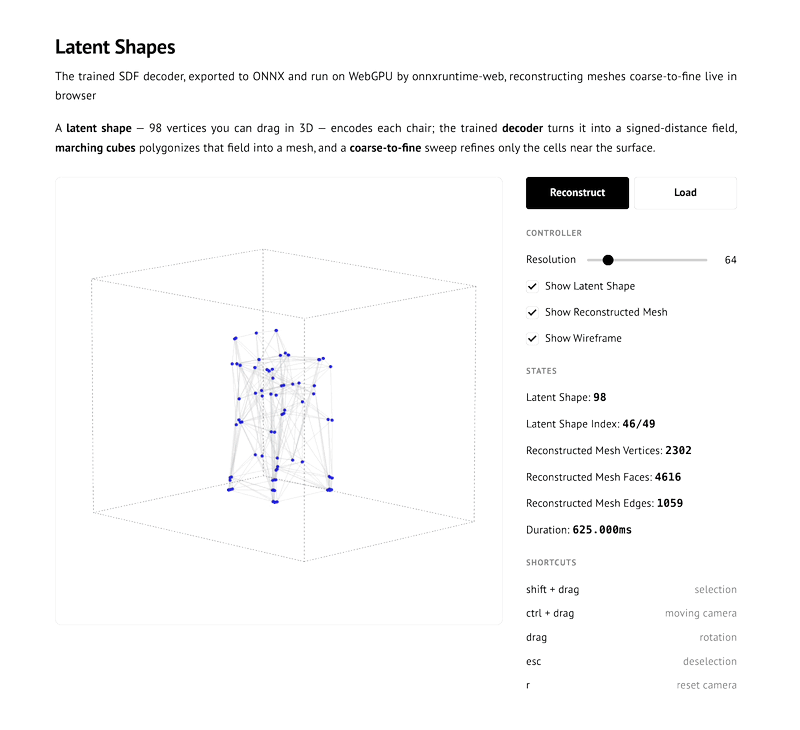
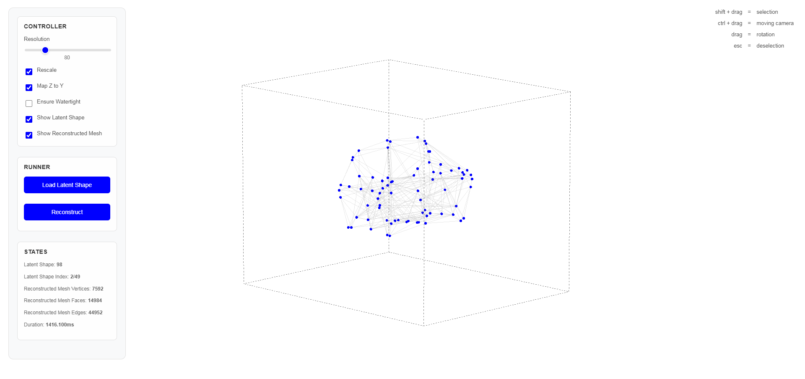
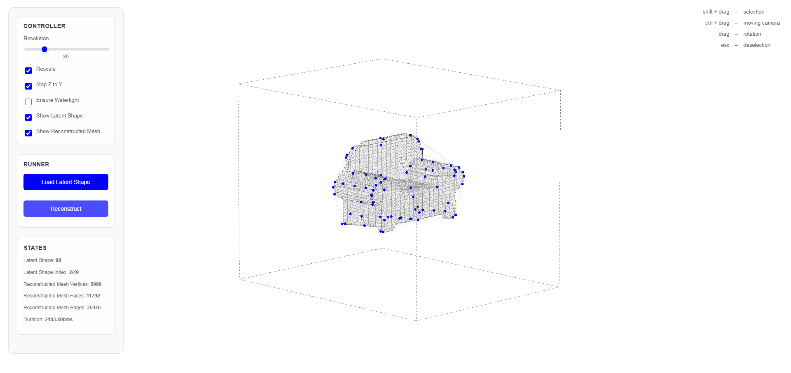

# Latent Shapes [](https://parkcheolhee-lab.github.io/latent-shapes/)

<div align="justify">
  In the best of my knowledge, latent vectors are initialized from a normal distribution and then updated during training to minimize the loss.
  Although linear interpolation can be used in the manipulations between latent vectors, and similar vectors can be placed in spatially close locations, the latent vectors themselves do not have a specific shape.
  <br><br>
  This project takes inspiration from this <a href="https://parkcheolhee-lab.github.io/latent-points/">perspective</a> and explores two main conceptions:
  <strong>1) Latent vectors with geometric shape ─</strong> exploring what happens if we give the latent vectors a geometric structure, and how that might help us better understand or control the results;
  <strong>2) Interactive manipulation using the latent vector ─</strong> making it possible for people to easily change and play with the latent vectors, so they can see and understand the effects right away and create new shapes or designs interactively.
  <br><br>
  <mark>The detailed process of this project is archived <a href="https://parkcheolhee-lab.github.io/latent-shapes/">here</a>.</mark>
</div>

<br>

<div align="center" text-align="justify">
  　　
  <p align="center">
    <i>
    Latent Vector Manipulation <br> with Mouse Dargging
    </i>
  </p>
</div>

<br><br>

# Demo

### In the browser

<div align="justify">
  The demo runs entirely in your browser — nothing to install and no server: <strong><a href="https://parkcheolhee-lab.github.io/latent-shapes/">try it here</a></strong>.
  The trained decoder is exported to ONNX and executed client-side by <code>onnxruntime-web</code>, on WebGPU when the browser supports it and on WASM otherwise.
  Reconstruction samples the SDF coarse-to-fine, refining only the cells near the surface, so the mesh appears within a second and sharpens progressively while the rest computes.
</div>

<br>

### Running locally

<div align="justify">
  The local demo can run on both CPU and GPU. However, CPU inference is significantly slower. For reference, using RTX 3060 Laptop GPU at 80 for resolution, mesh reconstruction took approximately 1500ms. To run the demo, execute the <code>app.py</code> after changing the directory to the <code>latent_shapes/demo</code>. 
</div>

<br>

```
  cd latent_shapes/demo && python app.py

  (...)

  INFO:     Will watch for changes in these directories: ['/root/latent-shape-interpolator/latent_shapes/demo']
  INFO:     Uvicorn running on http://0.0.0.0:7777 (Press CTRL+C to quit)
  INFO:     Started reloader process [226582] using StatReload
  INFO:     Started server process [226678]
  INFO:     Waiting for application startup.
  INFO:     Application startup complete.
```

<br>


<div align="center" display="flex">
  　　
  
  <br><br>
  <p align="center">
    <i>
    interpolator.html
    </i>
  </p>
</div>

<br><br>


# Installation

This repository uses the [image](/.devcontainer/Dockerfile) named `nvcr.io/nvidia/pytorch:23.10-py3` for running devcontainer.


1. Ensure you have Docker and Visual Studio Code with the Remote - Containers extension installed.
2. Clone the repository.

    ```
        git clone https://github.com/PARKCHEOLHEE-lab/latent-shapes.git
    ```

3. Open the project with VSCode.
4. When prompted at the bottom left on the VSCode, click `Reopen in Container` or use the command palette (F1) and select `Remote-Containers: Reopen in Container`.
5. VS Code will build the Docker container and set up the environment.
6. Once the container is built and running, you're ready to start working with the project.


<br><br>

# Limitations and Future Works

<div align="justify">
  The most critical limitation is that the latent shape vertices do not understand shapes at the semantic part level.
  Each of the 98 vertices is a purely geometric handle over a nearby region of space — no vertex corresponds to a part a person would name, such as the backrest, an armrest, or a leg.
  As a result, editing a specific part is indirect: you have to discover which vertices influence it by trial and error, and a single drag can also deform neighboring parts you did not intend to touch.
  <br><br>
  A promising future work is making the latent shape part-aware — for example, aligning vertices (or groups of them) with semantic part annotations such as <a href="https://partnet.cs.stanford.edu/">PartNet</a>, or learning the grouping directly, so that grabbing "the armrest" moves exactly the vertices that encode it.
  This would turn the interaction from space-level dragging into part-level editing.
</div>